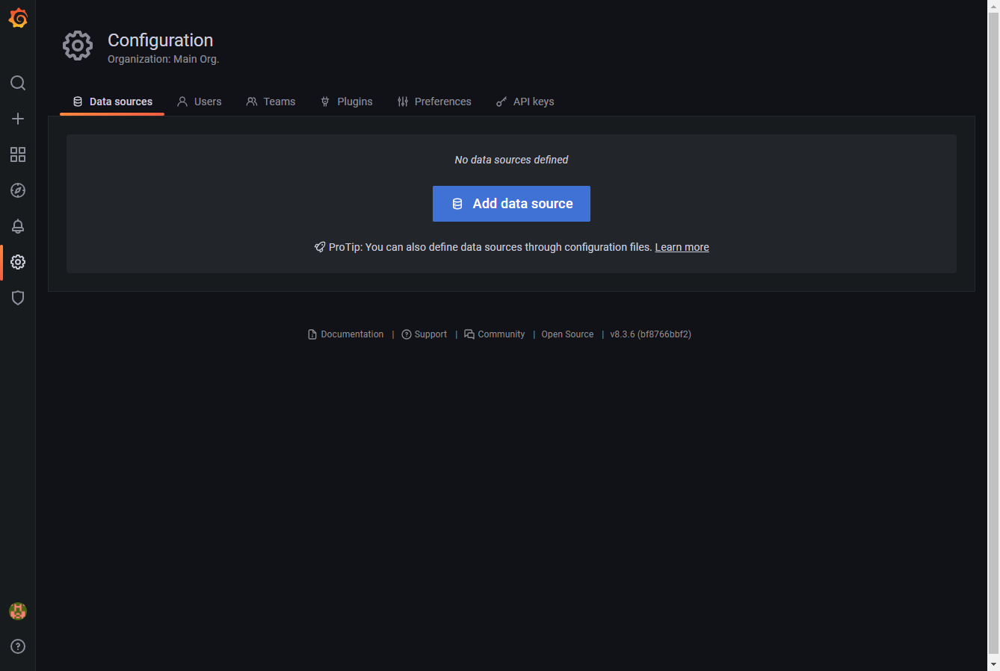
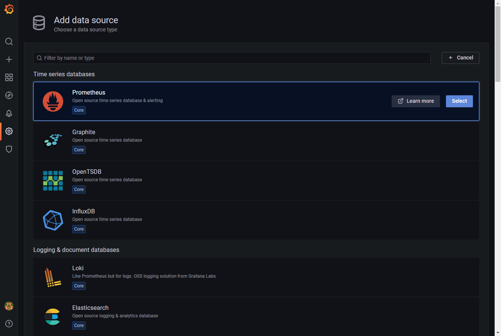
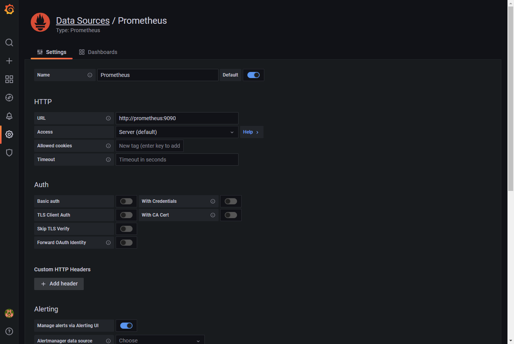
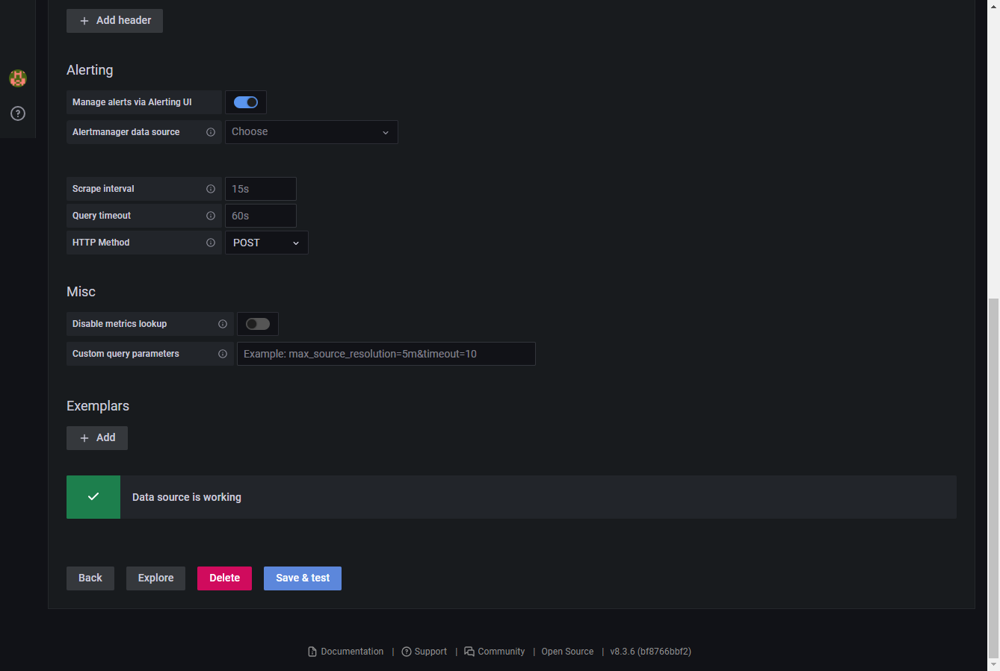
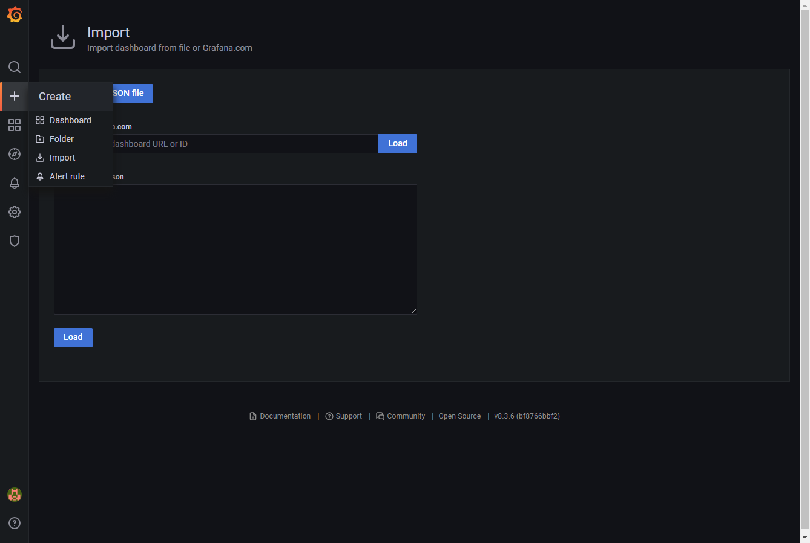
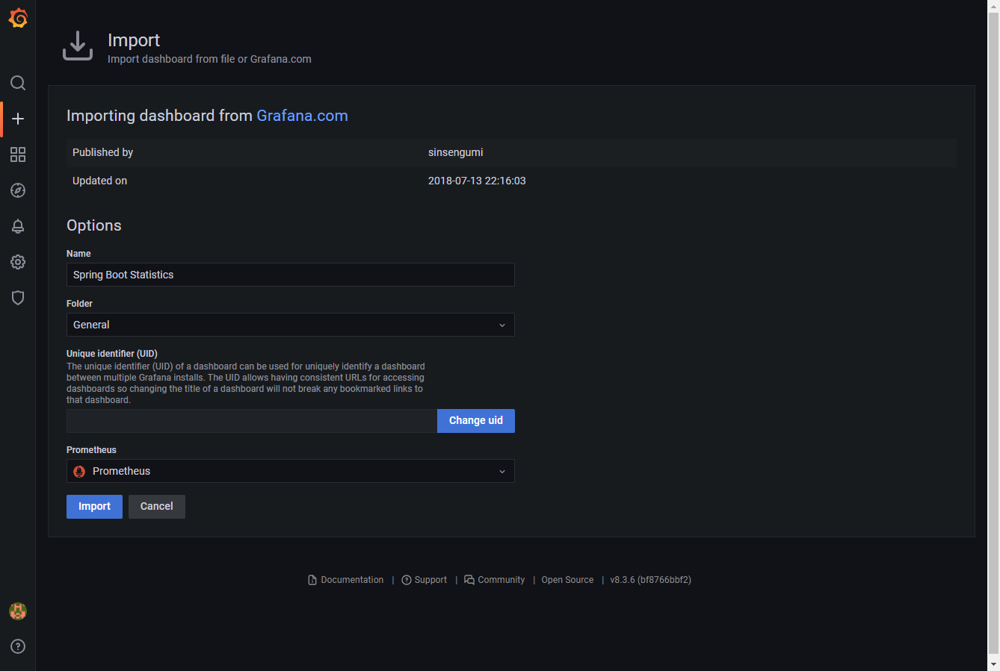
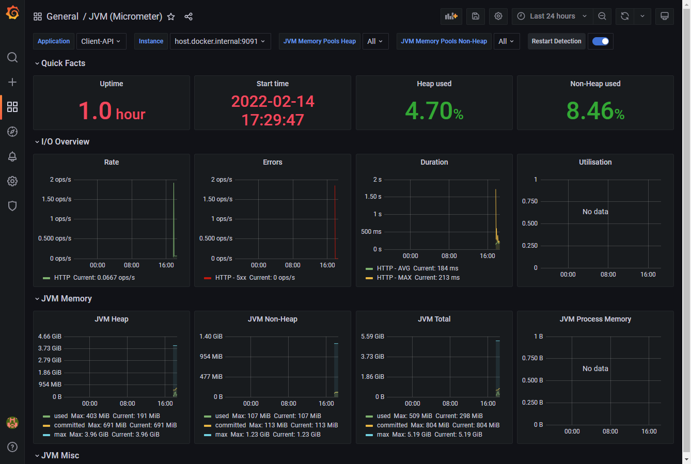

### 내용
- 코틀린과 GRPC를 이용하여 MSA 구성 예제와 프로메테우스와 그라파나를 이용하여 스프링 부트 어플리케이션 모니터링 예제

### 프로젝트 경로
|프로젝트|경로|설명|
|---|---|---|
|게이트웨이 서버|gateway|MSA 를 위한 Gateway 프로젝트|
|관리자 API 서버|admin||
|클라이언트 API 서버|client||
|로그 API 서버|log||
|GRPC Interface|grpc-interface|MSA 를 위해 서버간 통신을 위해 GRPC Interface 프로젝트|
|Jmeter 테스트|jmeter-test-sample|Jmeter 테스트를 위한 jmx 파일|

### 사용한 도커 명령어
##### Docker Network 생성

```
docker network create --driver=bridge my-network
```

##### RabbitMQ Docker

- 도커 이미지 다운로드

```
docker pull rabbitmq
```

- 도커 컨테이너 생성

```
docker run -d --name rabbitmq \
--log-opt max-size=100m \
--log-opt max-file=5 \
--net my-network
-p 15672:15672 \
-e RABBITMQ_DEFAULT_USER=admin \
-e RABBITMQ_DEFAULT_PASS=Dlek@10241025 \
-p 5672:5672 \
rabbitmq:3-management
```

- 브라우저 접속: http://127.0.0.1:15672/ 해서 위의 아이디 비밀번호로 접근가능

##### MariaDB Docker

- 도커 이미지 다운로드

```
docker pull mariadb
```

- 도커 컨테이너 생성

```
docker run -d --name mariadb \
--log-opt max-size=100m \
--log-opt max-file=5 \
--net my-network \
-p 3300:3306 \
-e MYSQL_ROOT_PASSWORD=secret \
-e MYSQL_DATABASE=keycloak \
-e MYSQL_USER=keycloak \
-e MYSQL_PASSWORD=secret \
mariadb
```

### 예제 DDL 

```
CREATE TABLE `USER` (
  `id` int(4) NOT NULL AUTO_INCREMENT,
  `name` varchar(50) DEFAULT NULL,
  `description` text DEFAULT NULL,
  `create_date` datetime DEFAULT NULL,
  `update_date` datetime DEFAULT NULL,
  PRIMARY KEY (`id`)
) DEFAULT CHARSET=utf8mb3;

CREATE TABLE `USER_PHONE` (
  `user_id` int(4) NOT NULL,
  `id` int(4) NOT NULL,
  `phone_number` varchar(50) NOT NULL,
  PRIMARY KEY (`user_id`,`id`)
) DEFAULT CHARSET=utf8mb3;
```

### 모니터링을 위한 스프링 부트 설정
1. 스프링 부트 프로젝트에서 build.gralde.kts 에 라이브러리를 추가한다.

```
# Spring Boot Actuator 과 프로메테우스 사용을 위한 micrometer-registry-prometheus 를 추가한다.

dependencies {
	...
	implementation("org.springframework.boot:spring-boot-starter-actuator")
	implementation("io.micrometer:micrometer-registry-prometheus:1.8.2")
}
```

2. application.yml 에 아래의 내용을 추가한다.

```
spring:
  application:
    name: BootApp
management:
  endpoints:
    web:
      exposure:
        include: health, info, prometheus
  metrics:
    tags:
      application: ${spring.application.name}
```

3. 스프링 부트 프로젝트를 실행 후 http://localhost:9090/actuator 주소를 브라우저에서 접속한다. 그러면 아래와 같이 나오는 것을 확인 할 수 있다.
(포트 번호는 application.yml 에서 설정한 포트 입니다.)

```
{
  "_links":{
    "self":{
      "href":"http://localhost:9090/actuator",
      "templated":false
    },
    "prometheus":{
      "href":"http://localhost:9090/actuator/prometheus",
      "templated":false
    },
    "health":{
      "href":"http://localhost:9090/actuator/health",
      "templated":false
    },
    "health-path":{
      "href":"http://localhost:9090/actuator/health/{*path}",
      "templated":true
    },
    "info":{
      "href":"http://localhost:9090/actuator/info",
      "templated":false
    }
  }
}
```

4. 3번에서 prometheus 가 나오면 정상적으로 설정이 된것입니다.

### 모니터링을 위한 스프링 부트의 프로메테우스 설정 방법

1. 프로메테우스 도커 이미지를 받는다.

```
docker pull prom/prometheus
```

2. 도커에서 프로메테우스 컨테이너를 생성한다.

```
# 도커 명령어
# /data/prometheus 폴더를 생성한다.

docker run -d --name prometheus \
--log-opt max-size=100m \
--log-opt max-file=5 \
--net my-network \
-p 9999:9090 \
-v /data/prometheus/prometheus.yml:/etc/prometheus/prometheus.yml \
prom/prometheus
```

3. http://localhost:9999/ 로 브라우저에 접속해서 정상적으로 접속되면 설치가 완료된 것이다.

4. Spring Boot 어플리케이션 모니터링을 위해 프로메테우스 도커에 접속한다.

```
docker exec -it prometheus sh
```
5. 프로메테우스 설정 파일 폴더로 이동 후 vim 으로 파일을 연다.

```
cd /etc/prometheus
vi prometheus.yml
```

6. 아래와 같이 수정한다.

```
# static_configs > targets 의 host.docker.internal 값은 현재 프로메테우스는 도커로 설치 되어있고 스프링 부터 어플리케이션은 로컬호스트에서 작동중이기 때문에 아래와 같이 진행한 것이다.
# 추후 스프링 부터 어플리케이션이 도커로 실행이되면 host.docker.internal 값이 도커 스프링 부트 이름으로 변경되면 된다.
# 여러대 일 경우 job_name을 늘려주면 된다.

scrape_configs:
  - job_name: "prometheus"
    metrics_path: "/actuator/prometheus"
    static_configs:
      - targets: ["host.docker.internal:9090"]

7. 유의사항
  - 프로메테우스는 기본 15일까지의 데이터만 저장하므로 오랜기간 저장을 하려면 별도의 옵션이나 DB에 저장하는 방식을 변경해야 된다.
```

### 모니터링을 위한 프로메테우스와 그라파나 연동 방법

1. 그라파나 이미지를 받는다.

```
docker pull grafana/grafana
```

2. 도커에서 그라파나 컨테이너를 생성한다.

```
# 도커 명령어

docker run -d --name grafana \
--log-opt max-size=100m \
--log-opt max-file=5 \
--net my-network \
-p 3000:3000 \
grafana/grafana
```

3. http://localhost:3000/ 주소를 브라우저에 입력하여 접속 한다. 아이디/비밀번호는 admin/admin 이다.

4. 아래의 순서대로 진행 한다.

4-1. 데이터 소스를 추가 한다.


4-2. 프로메테우스를 선택한다.


4-3. 프로메테우스 정보를 입력한다. HTTP의 URL은 프로메테우스 URL 이다.(도커 네트워크를 구성했기 때문에 컨테이너 이름으로 접근이 가능하다.)


4-4. Save & Test 버튼을 클릭하여 저장 및 테스트를 진행한다.


4-5. 대시보드를 생성한다.


4-6. 대시보드를 2개([micrometer 대시보드](https://grafana.com/grafana/dashboards/4701) 와 [hikaricp 대시보드](https://grafana.com/grafana/dashboards/6083)) 추가한다. 맨 하단에 프로메테우스 데이터소스도 함께 선택 후  Import 버튼을 클릭한다.


4-7. 최종적으로 대시보드를 확인 할 수 있다.


5. 그라나파 대시보드를 다른 사이트에 공유(embedding) 를 하기 위해 아래와 같이 작업한다.

```
# 도커 접속
docker exec -it -u 0 grafana bash

# 그라파나 설정파일 접근
cd /etc/grafana

# ini 파일 열기
vi grafana.ini

# 설정파일에서 수정
allow_embedding = true
cookie_secure = true
cookie_samesite = none

# 수정 후 저장 및 도커 재시작
```

### 모니터링을 위한 사이트 참고
|주소|설명|
|---|---|
|[micrometer-registry-prometheus](https://micrometer.io/docs/registry/prometheus)|스프링 부트에서 사용되는 프로메테우스 연동 라이브러리|
|[grafana micrometer](https://grafana.com/grafana/dashboards/4701)|그라파나에서 사용되는 micrometer 대시보드|
|[grafana hikaricp](https://grafana.com/grafana/dashboards/6083)|그라파나에서 사용되는 프로메테우스 hikaricp 대시보드|
